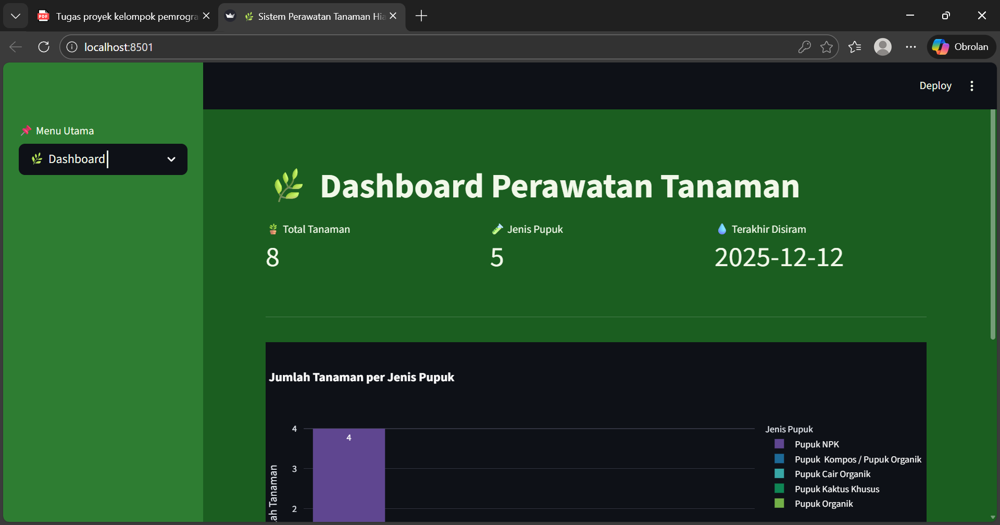
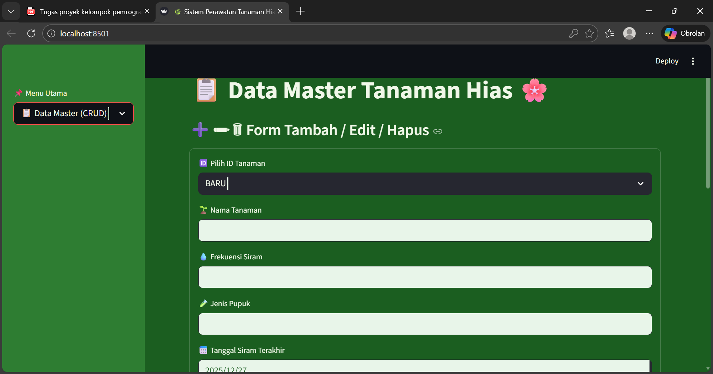

🌿 Sistem Perawatan Tanaman Hias

---

📝 Deskripsi Singkat Aplikasi
Aplikasi Sistem Perawatan Tanaman Hias merupakan aplikasi berbasis Python dan Streamlit yang digunakan untuk mencatat, mengelola, dan memantau data perawatan tanaman hias secara offline menggunakan file CSV.

Aplikasi ini dilengkapi dengan:
* Manajemen data tanaman (CRUD)
* Generate dan scan QR Code
* Visualisasi data (grafik & statistik)
* Log harian aktivitas sistem
* Login sederhana untuk keamanan

Aplikasi cocok digunakan untuk keperluan pembelajaran pemrograman terstruktur dan pencatatan perawatan tanaman skala kecil.

---

▶️ Cara Menjalankan Aplikasi

 1. Pastikan Python sudah terinstall
 2. Install library yang dibutuhkan

Jalankan perintah berikut di terminal / CMD:
```bash
pip install streamlit pandas opencv-python pillow plotly qrcode
```
 3. Jalankan aplikasi
Masuk ke folder project lalu jalankan:
```bash
streamlit run main.py
```
 4. Login Aplikasi

Gunakan akun berikut:
Username: `sepentin`
Password: `12345678`

---

📁 Struktur Folder

```
tanamann_qr/
│
├── main.py              # File utama Streamlit
├── utils.py             # Fungsi CRUD, log harian, CSV
├── qr_utils.py          # Generate QR Code
│
├── data/
│   ├── tanaman.csv      # Data tanaman
│   └── log.csv          # Log harian aktivitas
│
├── qr/
│   └── *.png            # File QR Code
│
├── README.md
```

---

🖼️ Screenshot Aplikasi (Minimal 2)

1.Halaman Dashboard
   


   * Menampilkan total tanaman
   * Statistik jenis pupuk
   * Grafik interaktif (Plotly)

2.Halaman CRUD & Scan QR



   * Form tambah/edit/hapus data tanaman
   * Scan QR menggunakan kamera
   * Input ID manual

---

⚙️ Penjelasan Fitur Utama

1️⃣ CRUD (Create, Read, Update, Delete)

Fitur CRUD digunakan untuk mengelola data tanaman:

Create: Menambahkan data tanaman baru
Read: Menampilkan data dalam tabel
Update: Mengubah data tanaman
Delete: Menghapus data tanaman

Data disimpan secara offline dalam file `tanaman.csv`.

---

2️⃣ QR Code

*Generate QR Code:berdasarkan ID tanaman
* Scan QR Code :menggunakan kamera (OpenCV)
* QR berisi ID tanaman yang digunakan untuk menampilkan detail tanaman secara otomatis

---

3️⃣ Log Harian

Setiap aktivitas sistem dicatat ke dalam file:

```
data/log.csv
```

Log mencatat:

* Waktu kejadian (`timestamp`)
* ID tanaman
* Jenis aksi (`create`, `update`, `delete`, `note`)
* Keterangan aktivitas

Contoh log:

```
2025-12-11T13:40:44,T004,update,Update data tanaman Tomat
```

Fitur ini memenuhi Pengujian Visualisasi Data – Log Harian.

---

4️⃣ Visualisasi Data

* Grafik interaktif menggunakan Plotly
* Statistik jumlah tanaman berdasarkan jenis pupuk
* Tabel data tanaman

---

5️⃣ Login Sistem

* Login sederhana menggunakan username dan password
* Membatasi akses ke aplikasi

---

👥 Pembagian Tugas (Jika Dikerjakan Tim)


| Nama Anggota | Tugas                          |
| ------------ | ------------------------------ |
| Anggota 1    | Perancangan sistem & flowchart |
| Anggota 2    | Implementasi CRUD & CSV        |
| Anggota 3    | QR Code & Scan Kamera          |
| Anggota 4    | Visualisasi data & laporan     |
| Anggota 5    | Dokumentasi & README           |

---

ℹ️ Catatan Tambahan

* Aplikasi berjalan tanpa koneksi internet
* Menggunakan file CSV sebagai database sederhana
* Cocok untuk pembelajaran pemrograman terstruktur

---

